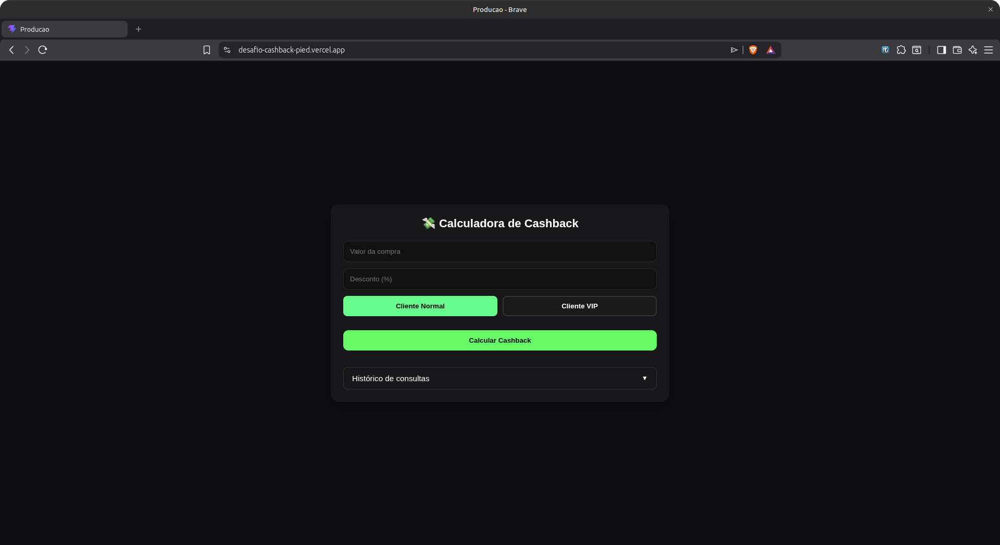

# 💸 Calculadora de Cashback - Fintech


Este projeto foi desenvolvido como resolução de um **Desafio Técnico**. Trata-se de um sistema financeiro (Fullstack) que simula o cálculo e o registro de _cashbacks_ para clientes de uma Fintech, aplicando diferentes regras de negócio com base no perfil do usuário e valor da compra.

**[Acessar projeto em produção](https://desafio-cashback-pied.vercel.app/)**

<p align="center">
  
</p>

## ✨ Funcionalidades

- **Cálculo Dinâmico:** Calcula o valor final e o cashback com base no desconto aplicado e no tipo de cliente.
- **Validação de Dados:** Bloqueio de inputs inválidos (ex: descontos negativos ou acima de 100%) direto no frontend para otimização de requisições.
- **Renderização Condicional:** Selos visuais dinâmicos (ex: 🚀 _Cashback Dobrado_ para compras acima de R$ 500).
- **Rastreamento de Origem:** Captura de IP e tratamento do `User-Agent` (Device) para identificar o navegador e sistema operacional da transação (ex: _Firefox (Linux)_).
- **Histórico em Tempo Real:** Listagem das últimas consultas com scroll estilizado, alimentada pelo banco de dados.
- **UI/UX** Interface focada em conversão com tema "Dark Mode" moderno, feedbacks visuais (Hover/Active).

## 💼 Regras de Negócio Implementadas

A lógica central da calculadora obedece aos seguintes critérios:

1. **Tipos de Cliente:** Diferenciação entre "Cliente Normal" e "Cliente VIP" (impactando diretamente na API de cálculo).
2. **Desconto Limitado:** O percentual de desconto não pode ser menor que 0% nem maior que 100%.
3. **Cashback Dobrado:** Compras que ultrapassam o valor de R$ 500,00 recebem uma bonificação promocional visual e matemática no sistema.

## 🛠️ Tecnologias Utilizadas

**Frontend:**

- React.js (Hooks, Renderização Condicional)
- TypeScript (Tipagem rigorosa, Interfaces)
- Vite (Build tool)

**Backend:**

- Python 3
- FastAPI (Rotas, Validação de Schemas com Pydantic)
- Supabase / PostgreSQL (Banco de Dados em Nuvem)

## 🔌 Endpoints da API

Base URL: `https://desafio-cashback-api.onrender.com`

| Método | Rota | Descrição |
|---|---|---|
| `GET` | `/` | Health check |
| `POST` | `/cashback/` | Calcula cashback e persiste no banco |
| `GET` | `/cashback/historico` | Retorna histórico de consultas |

## 🏗️ Arquitetura do Frontend

O projeto foi estruturado em camadas com separação de responsabilidades:

- **`api.ts`** — Service layer: isola todas as chamadas HTTP
- **`useCashback.ts`** — Hook customizado: gerencia estado, validações e orquestra chamadas ao service
- **`ConsultaPreco.tsx`** — Componente principal: formulário e renderização de resultados
- **`Historico.tsx`** — Componente isolado com CSS Module próprio: renderiza e formata o histórico de transações

## 🚀 Como rodar localmente

### Backend

```bash
cd backend
python3 -m venv venv
source venv/bin/activate
pip install -r requirements.txt
cp .env.example .env  # preencher com suas credenciais Supabase
uvicorn app.main:app --reload
```

### Frontend

```bash
cd frontend
npm install
npm run dev
```

## ⚠️ Limitações Conhecidas

### Cold start no Render

A API está hospedada no plano gratuito do Render, que hiberna após 15 minutos de inatividade. A primeira requisição pode levar até 30 segundos para responder.

### Histórico compartilhado em redes com CGNAT

O histórico é isolado por IP público. Operadoras móveis e alguns provedores residenciais utilizam CGNAT, compartilhando um único IP entre vários usuários.
